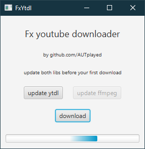
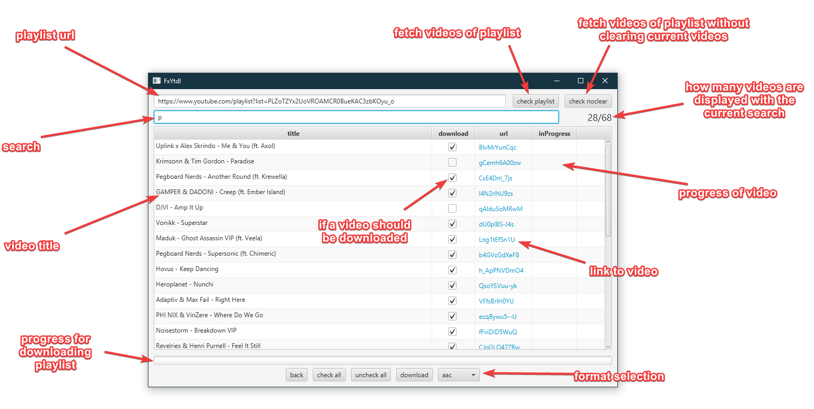
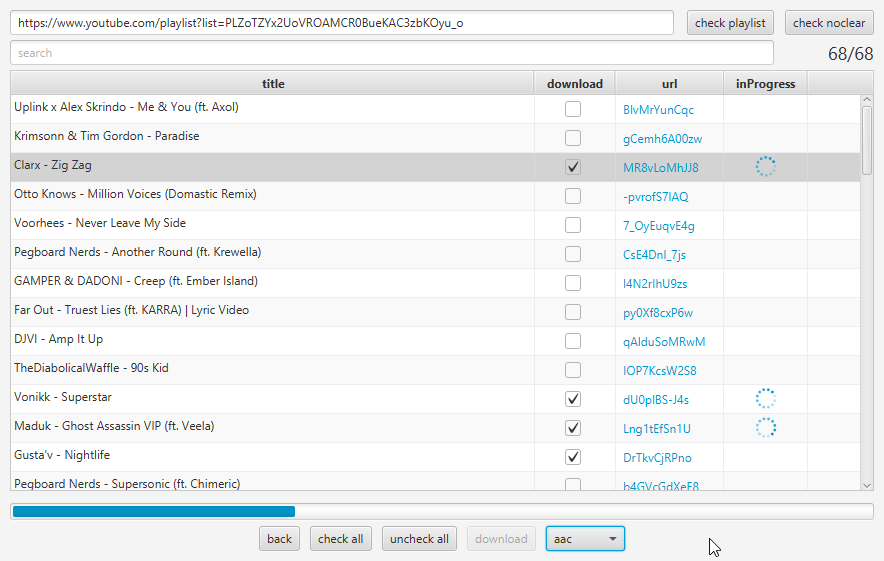

# FxYtdl

This is a javafx ui client for [youtube-dl](https://github.com/rg3/youtube-dl), main use being downloading playlists and extracting the audio.

## Features

- download playlists with table of videos, select videos to download individually
- remembers already downloaded videos of playlists
- buttons for easy updating of ffmpeg and youtube-dl
- select audio format with combobox
- search for videos in playlist

## Screenshots

